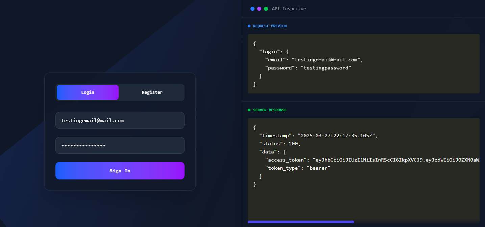
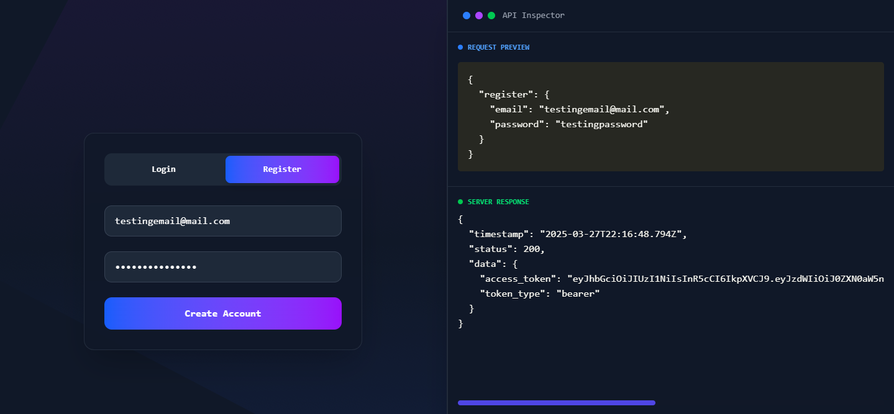
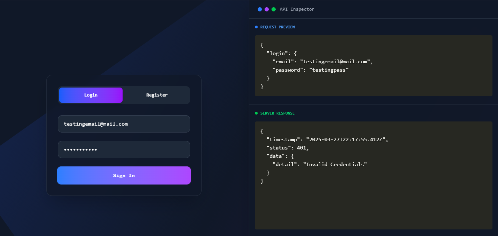
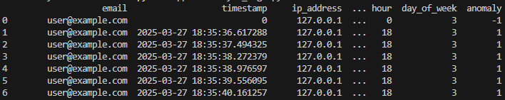

# 🚀 SmartAuth – Intelligent Authentication System with Anomaly Detection

[](https://fastapi.tiangolo.com/)
[](https://reactjs.org/)
[](https://opensource.org/licenses/MIT)
[](mailto:nbaez414@gmail.com)


SmartAuth is a full-stack web authentication system with a **FastAPI** backend and a **React** frontend, crafted with a professional and modern approach. It includes **unsupervised machine learning techniques** to detect suspicious or unusual login activity in real-time.

🔗 **Live Demo:** [https://smartauth.nilfred.com/](https://smartauth.nilfred.com/)

---

## 🧠 Project Goal

> Showcase a high level of proficiency in Python, modern API architecture, and AI-driven security analysis — ideal as a professional portfolio piece or technical showcase.

---

## 📸 Preview








---

## 📂 Technologies Used

- ⚙️ Backend: **FastAPI**, **SQLAlchemy**, **Uvicorn**, **SQLite**
- 🔐 Security: **Passlib** (hashing), **python-jose** (JWT)
- 📊 Machine Learning: **Pandas**, **Scikit-Learn**, **IsolationForest**
- 🎨 Frontend: **React**, **TailwindCSS**, **Framer Motion**, **Prism.js**
- 🐳 Docker: Backend ready for deployment

---

## ⚙️ Key Features

- [x] Register/Login with hashed passwords and JWT
- [x] Modern RESTful API with Swagger docs
- [x] Automatic access logging (IP, user-agent, timestamp)
- [x] AI-powered anomaly detection with Isolation Forest
- [x] Futuristic frontend with real-time JSON terminal
- [x] Dockerized backend ready for production

---

## 📦 Setup & Run Instructions

### 🔧 Requirements

- Python 3.10+
- Node.js 18+ (for frontend)
- Docker (optional)

### 💻 Clone the Repository

```bash
git clone https://github.com/nilfredb/SmartAuth.git
cd SmartAuth
```

### 🚀 Run the Backend with Docker

```bash
docker compose up --build
```

Visit: [http://localhost:8000/docs](http://localhost:8000/docs)

> 🟢 **Recommended for development**: run the backend manually without Docker for better debugging and faster reloads.

---

### 🌐 Run the Frontend (React)

```bash
cd frontend
npm install
npm run dev
```

Visit: [http://localhost:5173](http://localhost:5173)

---

## 🧪 Alternative Usage Modes

### ▶️ Run the Backend **without Docker**

You can run the backend manually with Uvicorn (recommended for local development):

```bash
# Create virtual environment (optional)
python -m venv venv
source venv/bin/activate  # on Windows: venv\Scripts\activate

# Install dependencies
pip install -r requirements.txt

# Start the server
uvicorn app.main:app --reload
```

Access the API at: [http://localhost:8000/docs](http://localhost:8000/docs)

---

### ⚡ Simple Frontend without Node.js

For quick testing or if you don't want to install Node.js, you can open the basic HTML frontend:

```bash
frontend/index.html
```

This uses a simple form and JavaScript `fetch()` to call the API — perfect for lightweight testing.

---

## 📊 AI-based Access Log Analysis

The `analyze_logs.py` script uses machine learning to detect unusual access patterns:

- Labels each access as normal or anomalous (`anomaly: 1 / -1`)
- Exports analysis to `log_analysis.csv`
- Great for security auditing or automation

```bash
python app/ml/analyze_logs.py
```

---

## 🛠 Project Structure

```
smartauth/
├── app/
│   ├── routes/
│   ├── models.py
│   ├── database.py
│   ├── main.py
│   └── ml/analyze_logs.py
├── frontend/
│   └── React app with Tailwind and Framer Motion
├── smartauth.db
├── Dockerfile
├── requirements.txt
├── docker-compose.yml
└── README.md
```

---

## ✨ Credits & Author

This project was developed by me as an advanced technical exercise to showcase expertise in:

- Modern backend development with Python
- API design and consumption
- Applied machine learning for security use cases
- Functional and elegant UI/UX for developer tools

---

## 📬 Contact

> Interested in collaboration, hiring, or feedback?
> [📧 Email](mailto:nbaez414@gmail.com)
